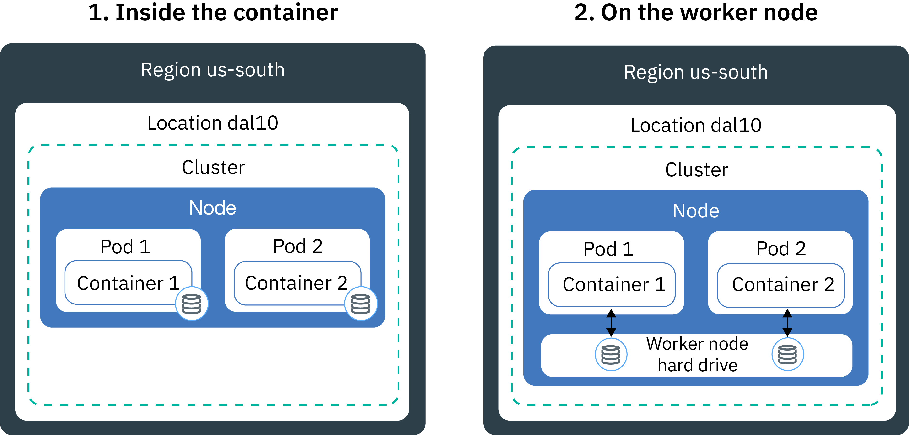
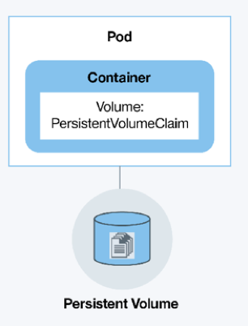
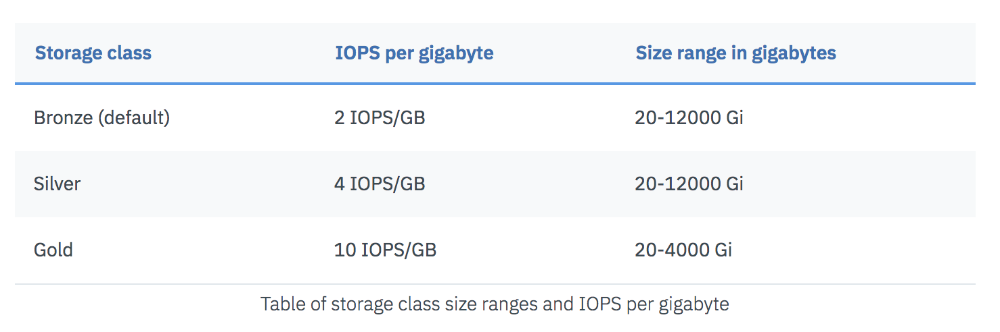
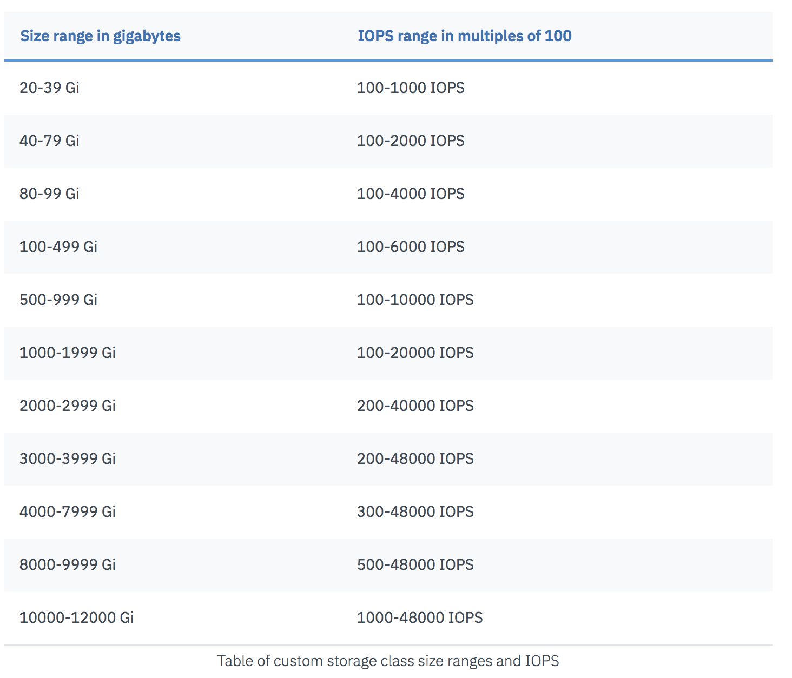

# Storing Data

Containers are ephemeral, so Kubernetes and IBM Cloud provides options for apps that require persistent storage and need to share data across pods.

## Resources
- [IKS storage documentation](https://cloud.ibm.com/docs/containers?topic=containers-storage_planning)
- [Tutorial with Kubernetes and Object Storage](https://cloud.ibm.com/docs/tutorials?topic=solution-tutorials-pub-sub-object-storage#asynchronous-data-processing-using-object-storage-and-pub-sub-messaging)

## Storage options

**Persistent storage considerations**
- If you want to use Kubernetes native resources (persistent volume claims)
- If you're integrating with existing database or storage options
  - service binding for cloud services
- Replication and back up needs
  - Back ups available with PVCs
  - Replication from app or use IBM Cloud Object Storage or database (e.g. Compose)
- Using a single or multi-zone cluster
- Type of read/write operations and type of apps that you're running
  - Object storage is read/write once. 1:1 between pod and storage

**Multi-zone options**
- Same, but Object and File storage do not sync across regions
    - Elasticsearch, Cassandra
    - Cloud Object Storage is recommended
- To update existing PVCs, apply labels to allow pods to deploy to correct region
- PVCs are created in round robin fashion

**Persistent volume claims**

Options
- Static
  - Existing storage from infrastructure
- Dynamic
  - Created based on specifications

Types
- File
- Block
  - ideal for statefulsets, apps that need stable unique identifiers 
- Cloud Object

Endurance options

Performance options

## What's next?

[Create a dynamic persistent volume claim.](workshop.md)
